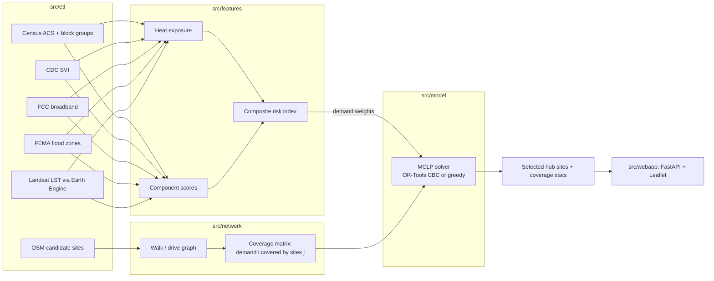

# Architecture

HeatSafeNet picks where to put cooling and connectivity resilience hubs so that the most heat-vulnerable people are within reach of one. It has four stages: ETL, risk features, network coverage, and optimization, plus a FastAPI web app on top.

## Pipeline



## The optimization model

Maximal Covering Location Problem (MCLP):

- `y_j = 1` if candidate site `j` is opened, `x_i = 1` if demand block group `i` is covered.
- Maximize `sum_i w_i x_i`, where `w_i` is the block group's composite risk weight.
- Subject to `sum_j y_j <= K` (budget) and `x_i <= sum_{j in N(i)} y_j` (a block group only counts as covered if some opened site reaches it within the travel threshold).
- Optional equity constraint: the top quarter of block groups by risk must receive at least a set share (default 60%) of their total weight in coverage.

`solve_mclp_ortools` solves this exactly with CBC. `solve_mclp_greedy` repeatedly opens the site that adds the most uncovered weight, which is guaranteed to reach at least 63% (1 - 1/e) of the optimum and is used when no solver is installed.

## Benchmark results

`python benchmarks/bench_mclp.py`:

| Instance | K | Exact solve | Greedy | Greedy / optimal | Demand covered |
| --- | --- | --- | --- | --- | --- |
| Bundled county data (100 demand, 25 sites) | 3 | ~550 ms | <1 ms | 0.989 | 67% |
| Bundled county data | 5 | ~900 ms | <1 ms | 0.982 | 87% |
| Bundled county data | 10 | ~6 ms | <1 ms | 1.000 | 100% |
| Random, 300 demand / 40 sites | 10 | ~4.7 s | ~1 ms | 0.982 | 71% |
| Random, 600 demand / 60 sites | 10 | ~22 s | ~3 ms | 1.000 | 55% |

Across all runs greedy averaged 99.1% of the optimal objective (worst 98.2%) while running hundreds to thousands of times faster. That makes greedy a sensible default for interactive use in the web app, with the exact solver reserved for final recommendations.

## Testing

```bash
pip install -r requirements-dev.txt
pytest -q
```

The tests check the exact solver against brute-force enumeration on random instances, that greedy stays feasible and within the (1 - 1/e) bound, that the budget is respected, that more sites never lowers coverage, the equity option, and that both bundled county datasets solve. GitHub Actions runs lint, tests, and the benchmark on every push.

A bug was fixed while adding these tests: the greedy fallback crashed on coverage data loaded from JSON, because JSON stores the demand indices as strings. It now normalizes the keys the same way the exact solver already did.

## Data note

The files in `data/int/` are demo data generated by `create_demo_data.py` so the app runs without API keys. The Harris County and Maricopa County coverage matrices in the repo are currently identical, and the walk and drive scenarios are identical too. The coverage percentages above describe the solver on that demo data, not measured real-world walking access. Running the full ETL and network stages (`make data features network`) with API keys produces county-specific inputs.
